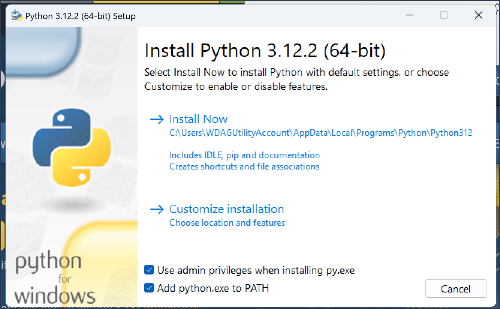

# Install Python
## Go to official website of python and download python according to your system https://www.python.org/downloads/

- Choose your operating system, basically website will detect your machine, but be sure what you are downloading

- Installation is straight forward, check the add PATH


### verify installation
After installation is completed, check if the installation is successful or not

  - go to any terminal (bash or powershell is recommended)
  ```
  python --version
  ```
  - If python is installed properly, it will gave you the version of python else gave the error
  

