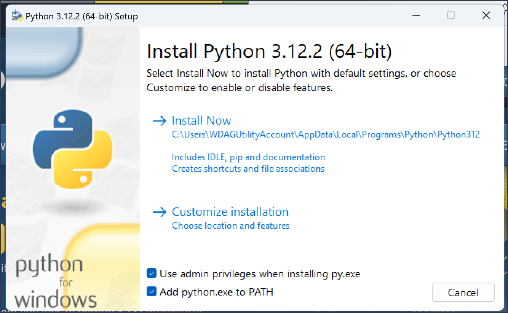
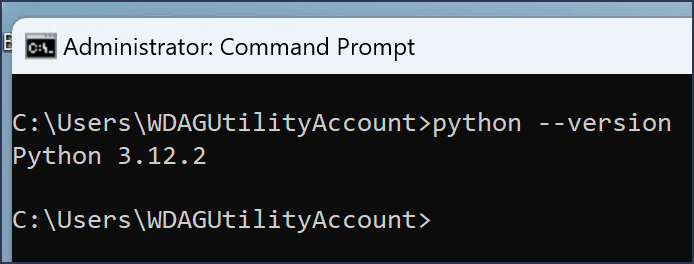
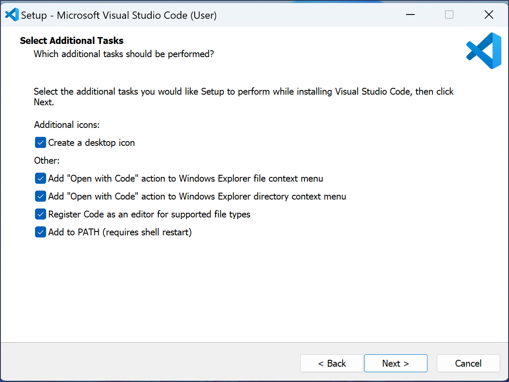
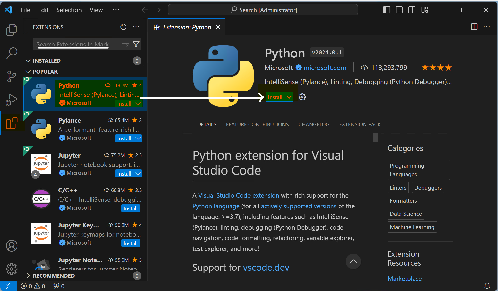
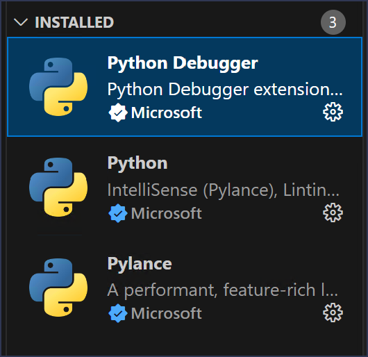

# Install Python
## Go to official website of python and download python according to your system https://www.python.org/downloads/

- Choose your operating system, basically website will detect your machine, but be sure what you are downloading

- Installation is straight forward, check the add PATH


### verify installation
After installation is completed, check if the installation is successful or not

  - go to any terminal (bash or powershell is recommended)
  ```
  python --version
  ```
  - If python is installed properly, it will gave you the version of python else gave the error
  


Python could be written in notepad :) but we will be using VS Code as our IDE

## Install VS Code
- go to download section of official vs code website and download vs code according to your operating system
https://code.visualstudio.com/Download

- Installation is straight forward,
    - Accept the agreement after reading it, go to next page
    - Select all options
        - Add **"Open with Code"** : this will open vs code from any folder when you right click and select open with Code.
        - Register Code as an editor 
        - add to PATH




After installation of vs code is completed, we need to add python extension.
### Add python extension
- click on Extensions in left bar
- In search box search for python, or usually Python extension is displayed in popular extension section
- Select Python extension by Microsoft
- It will open detail window in right, click on install button
  
   

- After installation is completed 3 extension will be installed.
    - Python
    - Python Debugger
    - Pylance
    
    

